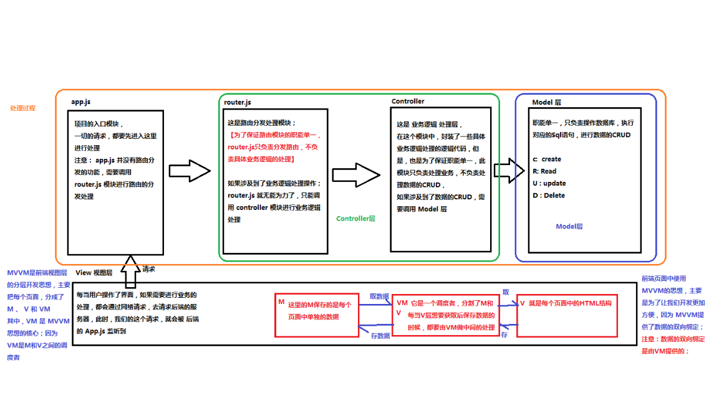
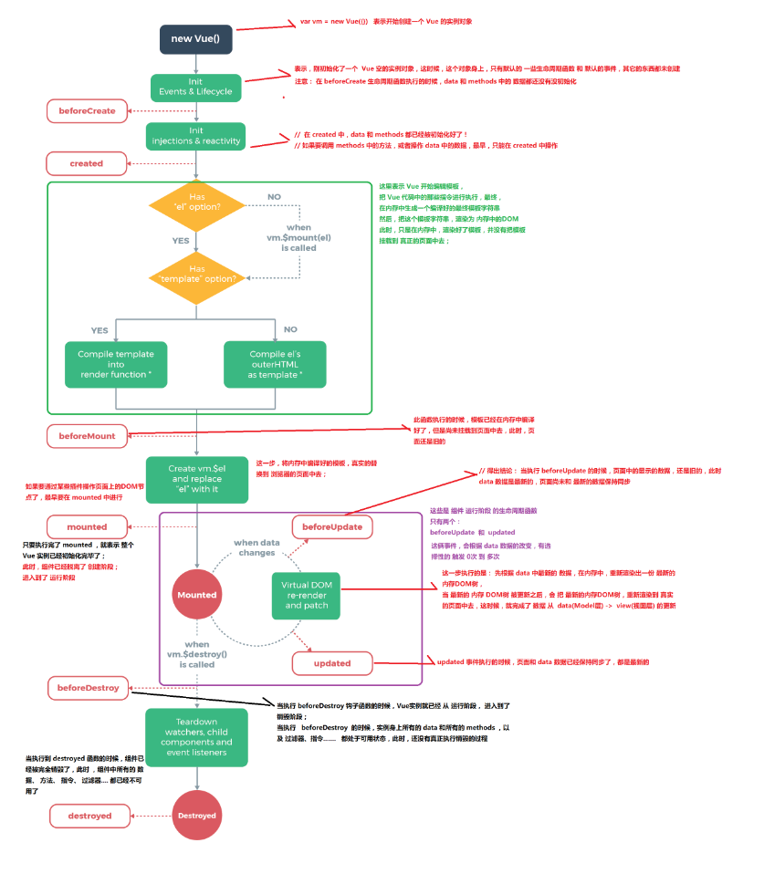

# Vue基础

## 如何理解MVVM



## Vue指令

### v-text ：

v-text会覆盖元素中原本的内容，但是 插值表达式 v-cloak 只会替换自己的这个占位符，不会把 整个元素的内容清空。

### v-html ：

可以转化字符中的html标签。

### v-bind：

提供的用于绑定属性的指令。

### v-on：

可简写为@

- .stop       阻止冒泡
- .prevent    阻止默认事件
- .capture    添加事件侦听器时使用事件捕获模式
- .self       只当事件在该元素本身（比如不是子元素）触发时触发回调
- .once       事件只触发一次

### v-model：

可以实现数据的双向绑定，一般只能用于表单。

### v-for:

1. 迭代数组

```
<ul>
  <li v-for="(item, i) in list">索引：{{i}} --- 姓名：{{item.name}} --- 年龄：{{item.age}}</li>
</ul>
```

2. 迭代对象中的属性

```
	<!-- 循环遍历对象身上的属性 -->

    <div v-for="(val, key, i) in userInfo">{{val}} --- {{key}} --- {{i}}</div>

```

3. 迭代数字

```
<p v-for="i in 10">这是第 {{i}} 个P标签</p>

```

### v-if 和 v-show 对比

​     v-if改变是删除元素， v-show添加一个display：none。v-if 有更高的切换消耗而 v-show 有更高的初始渲染消耗。因此，如果需要频繁切换 v-show 较好，如果在运行时条件不大可能改变 v-if 较好。

## 在Vue中使用样式

### 使用class样式

1. 数组

```
<h1 :class="['red', 'thin']">这是一个邪恶的H1</h1>
```

2. 数组中使用三元表达式

```
<h1 :class="['red', 'thin', isactive?'active':'']">这是一个邪恶的H1</h1>
```

3. 数组中嵌套对象

```
<h1 :class="['red', 'thin', {'active': isactive}]">这是一个邪恶的H1</h1>
```

4. 直接使用对象

```
<h1 :class="{red:true, italic:true, active:true, thin:true}">这是一个邪恶的H1</h1>
```

### 使用内联样式

1. 直接在元素上通过 `:style` 的形式，书写样式对象

```
<h1 :style="{color: 'red', 'font-size': '40px'}">这是一个善良的H1</h1>
```

2. 将样式对象，定义到 `data` 中，并直接引用到 `:style` 中

- 在data上定义样式：

```
data: {
        h1StyleObj: { color: 'red', 'font-size': '40px', 'font-weight': '200' }
}
```

- 在元素中，通过属性绑定的形式，将样式对象应用到元素中：

```
<h1 :style="h1StyleObj">这是一个善良的H1</h1>
```

3. 在 `:style` 中通过数组，引用多个 `data` 上的样式对象

- 在data上定义样式：

```
data: {
        h1StyleObj: { color: 'red', 'font-size': '40px', 'font-weight': '200' },
        h1StyleObj2: { fontStyle: 'italic' }
}
```

- 在元素中，通过属性绑定的形式，将样式对象应用到元素中：

```
<h1 :style="[h1StyleObj, h1StyleObj2]">这是一个善良的H1</h1>
```

## 过滤器

​     Vue 允许你自定义过滤器，可被用作一些常见的文本格式化。过滤器可以用在两个地方：mustache 插值和 v-bind 表达式。过滤器应该被添加在 JavaScript 表达式的尾部，由“管道”符指示；

### 调用格式  

```
<td>{{item.ctime | dataFormat('yyyy-mm-dd')}}</td>

```

### 私有过滤器

私有 `filters` 定义方式：

```javascript
filters: { // 私有局部过滤器，只能在 当前 VM 对象所控制的 View 区域进行使用
    dataFormat(input, pattern = "") { // 在参数列表中 通过 pattern="" 来指定形参默认值，防止报错
      var dt = new Date(input);
      // 获取年月日
      var y = dt.getFullYear();
      var m = (dt.getMonth() + 1).toString().padStart(2, '0');
      var d = dt.getDate().toString().padStart(2, '0');
      // 如果 传递进来的字符串类型，转为小写之后，等于 yyyy-mm-dd，那么就返回 年-月-日
      // 否则，就返回  年-月-日 时：分：秒
      if (pattern.toLowerCase() === 'yyyy-mm-dd') {
        return `${y}-${m}-${d}`;
      } else {
        // 获取时分秒
        var hh = dt.getHours().toString().padStart(2, '0')
        var mm = dt.getMinutes().toString().padStart(2, '0');
        var ss = dt.getSeconds().toString().padStart(2, '0');
        return `${y}-${m}-${d} ${hh}:${mm}:${ss}`;
      }
    }
  }
```

> 使用ES6中的字符串新方法 String.prototype.padStart(maxLength, fillString='') 或 String.prototype.padEnd(maxLength, fillString='')来填充字符串；

### 全局过滤器

```javascript
// 定义一个全局过滤器

Vue.filter('dataFormat', function (input, pattern = '') {
  var dt = new Date(input);
  // 获取年月日
  var y = dt.getFullYear();
  var m = (dt.getMonth() + 1).toString().padStart(2, '0');
  var d = dt.getDate().toString().padStart(2, '0');
  // 如果 传递进来的字符串类型，转为小写之后，等于 yyyy-mm-dd，那么就返回 年-月-日
  // 否则，就返回  年-月-日 时：分：秒
  if (pattern.toLowerCase() === 'yyyy-mm-dd') {
    return `${y}-${m}-${d}`;
  } else {
    // 获取时分秒
    var hh = dt.getHours().toString().padStart(2, '0');
    var mm = dt.getMinutes().toString().padStart(2, '0');
    var ss = dt.getSeconds().toString().padStart(2, '0');
    return `${y}-${m}-${d} ${hh}:${mm}:${ss}`;
  }
});

```

> 注意：当有局部和全局两个名称相同的过滤器时候，会以就近原则进行调用，即：局部过滤器优先于全局过滤器被调用！

## 按键修饰符

### 自定义键盘修饰符

1. 通过`Vue.config.keyCodes.名称 = 按键值`来自定义案件修饰符的别名：

```
Vue.config.keyCodes.f2 = 113;

```

2. 使用自定义的按键修饰符：

```
<input type="text" v-model="name" @keyup.f2="add">

```

### vue内置修饰符

- `.enter`
- `.tab`
- `.delete` (捕获“删除”和“退格”键)
- `.esc`
- `.space`
- `.up`
- `.down`
- `.left`
- `.right`

## 自定义指令

1.自定义全局和局部的 自定义指令：

```javascript
 // 自定义全局指令 v-focus，为绑定的元素自动获取焦点：
    Vue.directive('focus', {
      inserted: function (el) { // inserted 表示被绑定元素插入父节点时调用
        el.focus();
      }
    });
    // 自定义局部指令 v-color 和 v-font-weight，为绑定的元素设置指定的字体颜色 和 字体粗细：
     directives: {
        color: { // 为元素设置指定的字体颜色
          bind(el, binding) {
            el.style.color = binding.value;
          }
        },
        'font-weight': function (el, binding2) { // 自定义指令的简写形式，等同于定义了 bind 和 update 两个钩子函数
          el.style.fontWeight = binding2.value;
        }
      }

```

2.自定义指令的使用方式：

```javascript
<input type="text" v-model="searchName" v-focus v-color="'red'" v-font-weight="900">
```

## vue实例的生命周期(生命周期钩子)

- 主要的生命周期函数分类：

- 创建期间的生命周期函数：

- beforeCreate：实例刚在内存中被创建出来，此时，还没有初始化好 data 和 methods 属性
- created：实例已经在内存中创建OK，此时 data 和 methods 已经创建OK，此时还没有开始 编译模板
- beforeMount：此时已经完成了模板的编译，但是还没有挂载到页面中
- mounted：此时，已经将编译好的模板，挂载到了页面指定的容器中显示

- 运行期间的生命周期函数：

- beforeUpdate：状态更新之前执行此函数， 此时 data 中的状态值是最新的，但是界面上显示的 数据还是旧的，因为此时还没有开始重新渲染DOM节点
- updated：实例更新完毕之后调用此函数，此时 data 中的状态值 和 界面上显示的数据，都已经完成了更新，界面已经被重新渲染好了！

- 销毁期间的生命周期函数：

- beforeDestroy：实例销毁之前调用。在这一步，实例仍然完全可用。
- destroyed：Vue 实例销毁后调用。调用后，Vue 实例指示的所有东西都会解绑定，所有的事件监听器会被移除，所有的子实例也会被销毁。



## vue-resources

### get, post, jsonp请求

​		除了 vue-resource 之外，还可以使用 `axios` 的第三方包实现实现数据的请求

